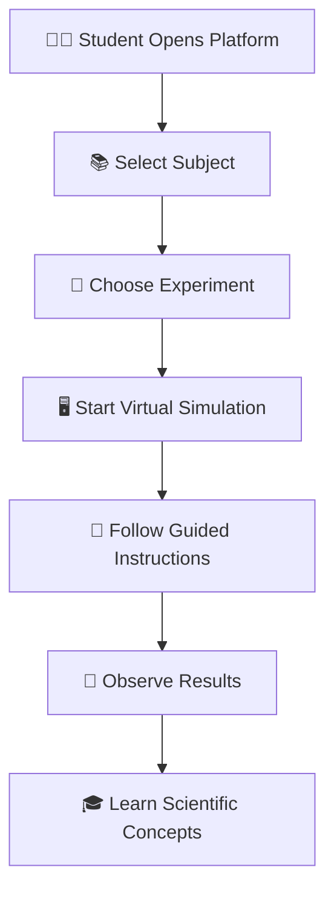

# 🔬 Virtual Science Lab Simulator

<div align="center">


### 🌍 Revolutionizing Practical Learning Through Virtual Experiments

🚀 Interactive • 🧪 Safe • 🌐 Accessible • 🎓 Educational

</div>

---

## Table of Contents

- [Overview](#-overview)
- [Vision](#-vision)
- [Problem Statement](#-problem-statement)
- [Our Solution](#-our-solution)
- [Key Features](#-key-features)
- [How It Works](#-how-it-works)
- [Tech Stack](#-tech-stack)
- [Architecture](#-architecture)
- [Project Structure](#-project-structure)
- [Installation & Setup](#-installation--setup)
  - [Frontend Setup](#-frontend-setup)
  - [Backend Setup](#-backend-setup)
  - [Running the Project](#-running-the-project)
- [Environment Variables](#-environment-variables)
- [API Documentation](#-api-documentation)
- [Experiment Preview](#-experiment-preview)
- [Contribution Workflow](#-contribution-workflow)
- [Developer Experience (DX)](#-developer-experience-dx)
- [License](#-license)

---

# 📖 Overview

**Virtual Science Lab Simulator** is an interactive web-based platform designed to help students perform science experiments virtually in a realistic and engaging environment.

The platform provides simulations for:

⚡ Physics Experiments
🧪 Chemistry Reactions
🧬 Biology Models & Activities

Students can learn practical concepts visually and interactively without requiring physical laboratories or expensive equipment.

---

# 🎯 Vision

Our goal is to make science education:

✅ Accessible to everyone
✅ Safe for students
✅ Affordable for institutions
✅ Interactive and engaging
✅ Available anytime, anywhere 🌐

---

# 🚨 Problem Statement

Many educational institutions face challenges such as:

❌ Limited laboratory infrastructure
❌ Expensive scientific equipment
❌ Lack of chemicals and resources
❌ Safety risks during practical sessions
❌ Inaccessibility for remote learners

As a result, students often miss hands-on practical learning experiences.

---

# 💡 Our Solution

The **Virtual Science Lab Simulator** bridges this gap by offering a fully digital laboratory experience.

### ✨ The Platform Enables Students To:

🔬 Perform realistic science experiments
📚 Learn with guided instructions
🖥️ Interact with simulations visually
🛡️ Practice safely without risks
🌍 Access labs remotely anytime

---

# ✨ Key Features

> **Note:** The app experiment pages are available under `/physics`, `/chemistry`, and `/biology`.

## 🧪 Chemistry Simulations

- Chemical reactions
- Color changes & observations
- Mixing compounds
- Virtual lab tools

---

## ⚡ Physics Experiments

- Motion simulations
- Electric circuits
- Force & gravity experiments
- Interactive mechanics

---

## 🧬 Biology Modules

- Human anatomy models
- Cell structures
- Virtual dissections
- Plant biology exploration

---

## 📖 Guided Learning

- Step-by-step experiment instructions
- Theory explanations
- Visual understanding of concepts

---

## 🌐 Web-Based Access

- No installation required
- Accessible from anywhere
- Works directly in the browser

---

## 🛡️ Safe & Cost Effective

- No dangerous chemicals
- No equipment damage
- Risk-free learning environment

---

# 🧠 How It Works



---

# 🛠️ Tech Stack

---

## 🧪 Experiment Preview

Open the labs from the main routes (via the app router):

- **Physics**: `/physics`
  - Available components: `VelocityAcceleration`, `MagneticFieldWires`, `ThumbRule`, `MagneticFieldDirection`
- **Chemistry**: `/chemistry`
  - Available components: `AcidBaseNeutralization`, `ChemistryEquipment`, `Condenser`, `VolcanoExperiment`
- **Biology**: `/biology`
  - Available components: `HumanBody`, `Mitochondria`, `Eye`, `Kidney`

---

# 🌐 API Documentation

For backend API reference, see: [docs/API_GUIDE.md](./docs/API_GUIDE.md)

When you run the backend locally, you can open:

- Swagger UI: http://127.0.0.1:8000/docs
- ReDoc: http://127.0.0.1:8000/redoc

---

# Environment Variables

This project expects backend environment variables for external services (e.g., database) and API configuration. Create a `.env` file in the backend directory and copy/align keys with your `.env.example` (if present).

Typical keys you may need (update based on your `backend/app/core/config.py`):

- `MONGODB_URL` (MongoDB connection string)
- `API_BASE_URL` (optional: frontend/backend API base)
- `CORS_ORIGINS` (optional: allowed origins)

---

# 🧩 Architecture

See: [docs/ARCHITECTURE.md](./docs/ARCHITECTURE.md)

---

## 🎨 Frontend

- ⚛️ React.js
- 🎨 Tailwind CSS
- 🌌 Three.js
- 📦 Framer Motion

---

## ⚙️ Backend

- 🐍 Python
- ⚡ FastAPI

---

## 🗄️ Database

- 🍃 MongoDB

---

## ☁️ Deployment

- ▲ Vercel (Frontend)
- 🚀 Render (Backend)

---

# 📂 Project Structure

```bash
virtual-science-lab/
│
├── frontend/
│   ├── src/
│   ├── components/
│   ├── pages/
│   └── assets/
│
├── backend/
│   ├── main.py
│   ├── routes/
│   ├── models/
│   └── utils/
│
├── README.md
└── CONTRIBUTING.md
```

---

# 🚀 Installation & Setup

## 📥 Clone Repository

```bash
git clone https://github.com/your-username/virtual-science-lab.git

cd virtual-science-lab
```

---

# 🎨 Frontend Setup

```bash
cd frontend

npm install

npm run dev
```

---

# ⚙️ Backend Setup

```bash
cd backend

pip install -r requirements.txt

uvicorn main:app --reload
```

---

# 🌐 Running the Project

## Frontend

```bash
http://localhost:5173
```

## Backend API

```bash
http://localhost:8000
```

---

# 📸 Future Enhancements

🚀 Multiplayer collaborative experiments
🤖 AI-powered learning assistant
🥽 VR/AR science simulations
📊 Student progress tracking
🏆 Gamification & quizzes
🎤 Voice-guided experiments
📱 Mobile app support

---

# 🎓 Educational Impact

This platform helps:

✅ Schools with limited infrastructure
✅ Remote learning students
✅ Beginners understand concepts visually
✅ Teachers demonstrate experiments digitally
✅ Institutions reduce laboratory costs

---

# 🤝 Contributing

We welcome contributions from developers, designers, educators, and science enthusiasts! 💙

## 📌 Steps to Contribute

1️⃣ Fork the repository
2️⃣ Create a new branch
3️⃣ Make your changes
4️⃣ Commit your code
5️⃣ Push changes
6️⃣ Open a Pull Request 🚀

---

# 📄 Contribution Guidelines

Please read:

👉 [CONTRIBUTING.md](./CONTRIBUTING.md)

---

# 🤝 Contributing

We welcome contributions from developers, designers, educators, and science enthusiasts! 💙

Contributions by @nikita09-lab 💙

## 📌 Steps to Contribute

If you found this project useful:

⭐ Star the repository
🍴 Fork the project
📢 Share with others
🐛 Report issues
💡 Suggest features

---

# 👨‍💻 Authors

Developed with ❤️ to make science education accessible and interactive for everyone.

---

# 📜 License

This project is licensed under the MIT License.

---

<div align="center">

# 🚀 Empowering Science Education Through Technology

### 🔬 Learn • Experiment • Explore • Innovate

</div>
